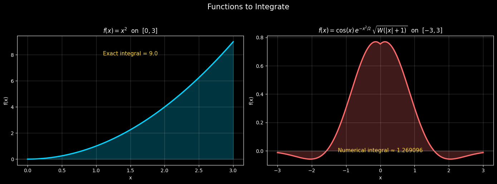
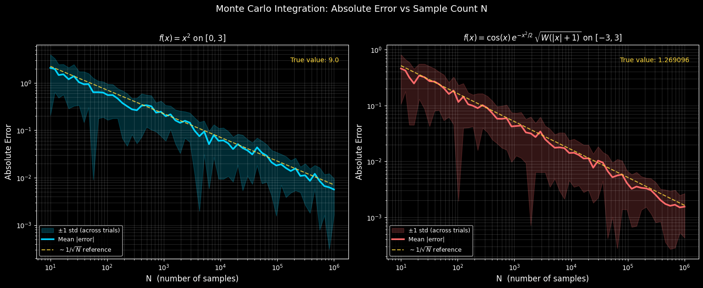
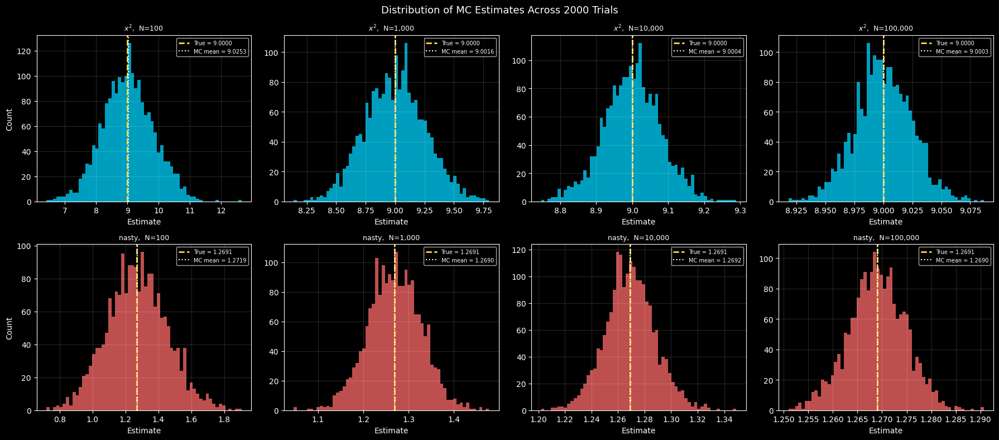

# 🎲 Monte Carlo Integration

A Python/Jupyter implementation of Monte Carlo integration comparing numerical approximation against known exact values, with convergence analysis and error visualization.

## What is Monte Carlo Integration?

Monte Carlo integration estimates definite integrals by exploiting the identity:

$$\int_a^b f(x)\, dx = (b-a) \cdot \mathbb{E}[f(X)], \quad X \sim \text{Uniform}(a, b)$$

By sampling $N$ random points uniformly over $[a, b]$ and averaging the function values, we get an estimate that converges to the true value at a rate of $O(1/\sqrt{N})$ — a direct consequence of the Central Limit Theorem. This convergence rate is **dimension-independent**, making Monte Carlo uniquely powerful for high-dimensional integrals where traditional methods fall apart.

---

## Functions Integrated

### Simple — $f(x) = x^2$ on $[0, 3]$
Exact answer: $\int_0^3 x^2\, dx = 9$. Used as a ground truth sanity check.

### Nasty — $f(x) = \cos(x)\, e^{-x^2/2}\, \sqrt{W(|x|+1)}$ on $[-3, 3]$
Where $W$ is the **Lambert W function** — the inverse of $z = we^w$. This function has no elementary antiderivative, so the "true" value is obtained via `scipy.integrate.quad` adaptive quadrature and used as the reference.



---

## Error Convergence

Both functions are integrated across sample sizes from $N=10$ to $N=10^6$. For each $N$, 30 independent trials are run and the mean absolute error is plotted on a log-log scale alongside the theoretical $1/\sqrt{N}$ reference line.



Both curves snap to the $1/\sqrt{N}$ slope — the constant differs based on the variance of $f$ under the sampling distribution, but the asymptotic rate is identical regardless of function complexity.

---

## Distribution of Estimates (CLT in Action)

At fixed sample sizes $N \in \{100, 1000, 10000, 100000\}$, 2000 independent MC estimates are computed and plotted as histograms. As $N$ grows, the distribution tightens symmetrically around the true value — a direct illustration of the Central Limit Theorem.



---

## Setup

```bash
git clone https://github.com/yourusername/monte-carlo-simulation
cd monte-carlo-simulation
python -m venv venv
venv\Scripts\activate        # Windows
pip install numpy scipy matplotlib jupyterlab ipykernel
python -m ipykernel install --user --name=monte-carlo --display-name "Python (monte-carlo-simulation)"
jupyter lab
```

Then open `monte_carlo_integration.ipynb` and run all cells.

---

## Dependencies

- `numpy` — random sampling and vectorized computation
- `scipy` — Lambert W function (`scipy.special.lambertw`) and adaptive quadrature (`scipy.integrate.quad`)
- `matplotlib` — all plots
- `ipykernel` — Jupyter kernel

---

## Key Takeaways

- Monte Carlo error converges at $O(1/\sqrt{N})$ regardless of function complexity
- The Lambert W function makes analytic integration essentially impossible — Monte Carlo doesn't care
- 1,000,000 samples gets you ~3 decimal places of accuracy reliably
- The CLT governs everything: estimates are asymptotically normally distributed around the true value
